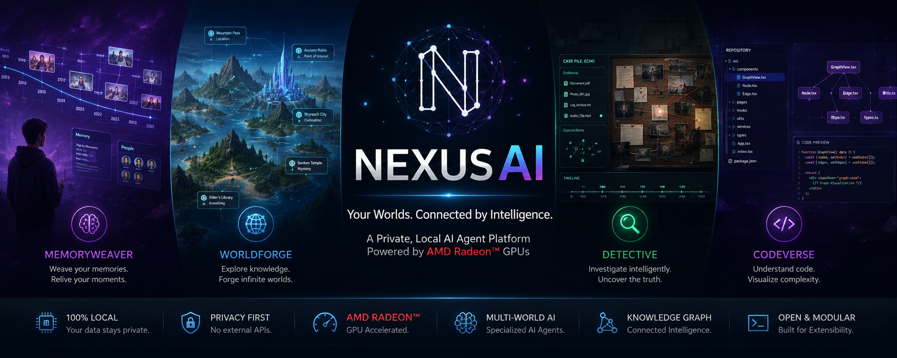
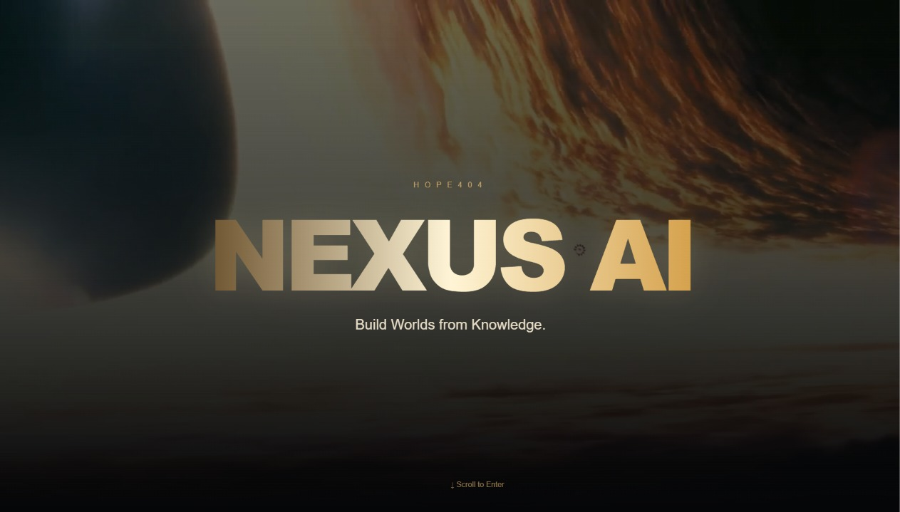
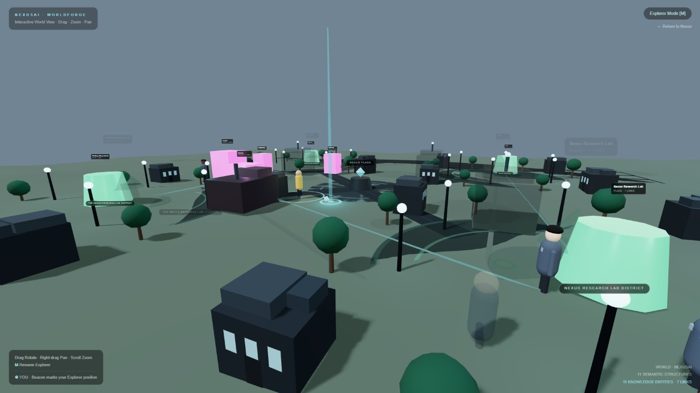
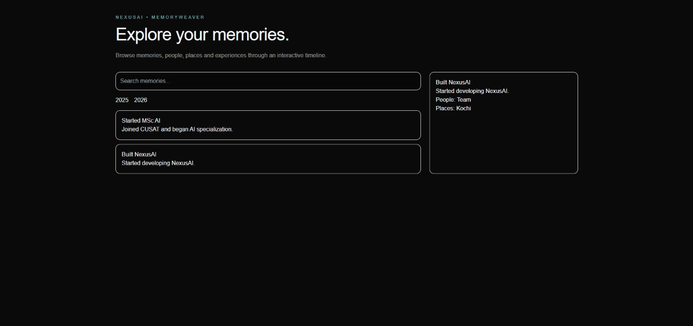
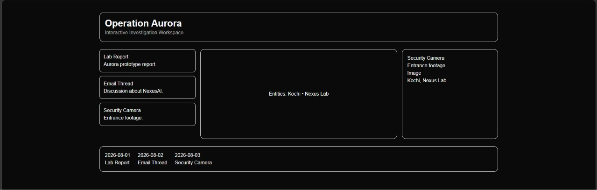
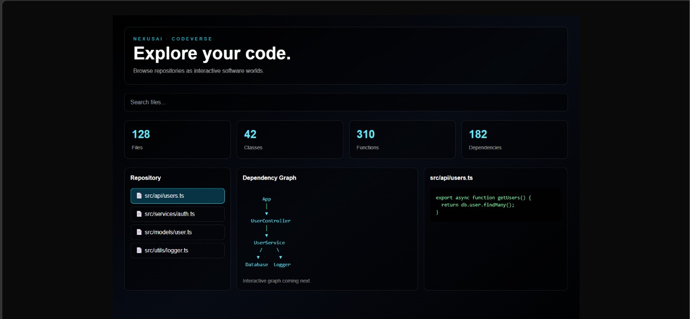

<p align="center">
  
</p>
<p align="center">
Python • FastAPI • Next.js • React • TypeScript • AMD ROCm
</p>

# Nexus AI

## 📌 Submission Resource

| Resource      | Link                                                                               |
| ------------- | ---------------------------------------------------------------------------------- |
| 🎥 Demo Video | https://drive.google.com/file/d/10mTQsKqZblKxurt56ckmtMS89U2y1wwH/view?usp=sharing |

## Private Local AI Agent Platform for AMD Radeon GPUs

> **Track 2 Submission - AMD Radeon AI Hackathon 2026**

NexusAI is a modular, locally deployable AI agent platform that transforms knowledge into interactive experiences. Instead of limiting AI to a chatbot, NexusAI introduces specialized AI worlds for memory exploration, semantic knowledge visualization, evidence-based investigation, and software repository intelligence.

Built to run locally with AMD Radeon GPU acceleration, NexusAI prioritizes privacy, explainability, and interactive visualization.

# Features

## 🌍 WorldForge

Transform structured knowledge into an explorable 3D semantic world.

- Interactive knowledge graph visualization
- Dynamic entity relationships
- Semantic terrain generation
- Explorer Mode
- Knowledge clustering
- Environmental storytelling

---

## 🧠 MemoryWeaver

A personal memory intelligence system.

- Interactive timeline
- Memory search
- Relationship mapping
- Context-aware memory browsing
- People & location linking

---

## 🔍 Detective

Evidence-driven investigation workspace.

- Timeline reconstruction
- Evidence explorer
- Relationship graph
- Source inspection
- Case analysis

---

## 💻 CodeVerse

Visualize software repositories as interactive worlds.

- Repository explorer
- Dependency visualization
- File browser
- Code preview
- Repository statistics

---

# Why NexusAI?

Traditional AI assistants return answers.

NexusAI creates worlds.

Instead of reading information, users explore it visually through dedicated AI environments optimized for different reasoning tasks.

---

# Architecture

```
                     User
                       │
                       ▼
              Next.js Frontend
                       │
      ┌────────┬────────┬────────┬────────┐
      ▼        ▼        ▼        ▼
 MemoryWeaver WorldForge Detective CodeVerse
      │        │        │        │
      └────────┴────────┴────────┘
                 │
           FastAPI Backend
                 │
      Embedding + Knowledge Engine
                 │
       Local AI Models (ROCm)
                 │
          AMD Radeon GPU
```

---

# Tech Stack

## Frontend

- Next.js 15
- React 19
- TypeScript
- Tailwind CSS
- Framer Motion
- Three.js
- React Three Fiber

## Backend

- FastAPI
- Python
- NetworkX
- FAISS
- Sentence Transformers

## AI

- Local Embedding Models
- Semantic Search
- Knowledge Graph Construction
- Retrieval-Augmented Reasoning

## Database

- SQLite
- JSON Knowledge Store

---

# Local Deployment

## Requirements

- Python 3.11+
- Node.js 20+
- npm
- Git

---

## Install

```bash
git clone <repository-url>

cd NexusAI

cd apps/web
npm install

cd ../../apps/api
pip install -r requirements.txt
```

---

## Start Backend

```bash
cd apps/api

uvicorn main:app --reload
```

Backend

```
http://localhost:8000
```

Swagger

```
http://localhost:8000/docs
```

---

## Start Frontend

```bash
cd apps/web

npm install
npm run dev
```

Frontend

```
http://localhost:3000
```

---

# AMD Radeon GPU Optimization

NexusAI is designed for local AI inference and supports AMD Radeon GPU acceleration through ROCm.

Optimizations include:

- Local embedding generation
- GPU-accelerated inference
- Reduced latency
- Fully offline execution
- No external API dependency
- Privacy-preserving local processing

---

# Project Structure

```
NexusAI/

├── apps
│   ├── api
│   └── web
│
├── docs
│
├── assets
│
└── README.md
```

---

# Screenshots

## Home



---

# WorldForge



---

# MemoryWeaver



---

# Detective



---

# CodeVerse



---

# Future Roadmap

- Multi-agent collaboration
- Voice interaction
- 3D knowledge worlds
- Multi-user collaboration
- Personal AI memory
- Repository reasoning
- World generation using LLMs

---

# Team

**Team:** Hope404

# License

MIT License
